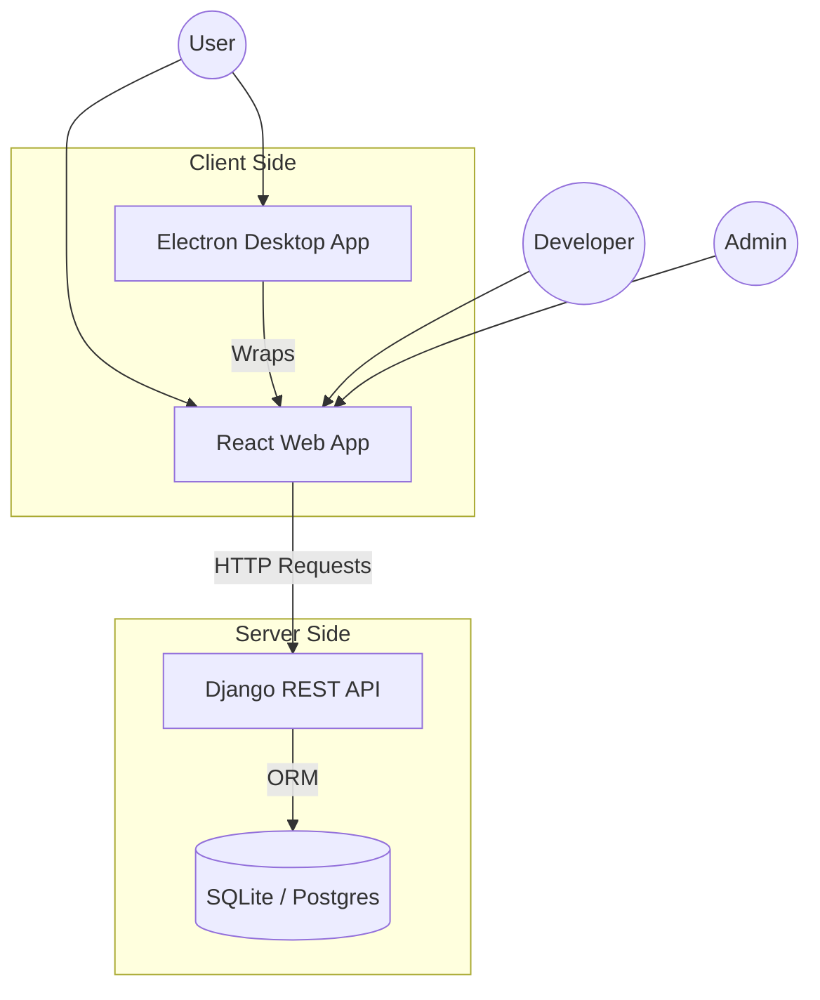

# IndieHub - Game Launcher Platform

**IndieHub** is a web and desktop application designed to centralize independent games and promote developers from underrepresented communities. It provides a robust validation system to ensure cultural, ethical, and religious compliance while offering a modern, bilingual (English/Arabic) interface for browsing, submitting, and downloading games.

---

## 🎮 Main Features

- **Game Submission**: Independent developers can submit their games for validation.
- **Content Validation**: dedicated Admin system to verify games meet quality and cultural standards.
- **Game Browser**: Users can search, filter, and download approved games.
- **Analytics & Popularity**: Automatically tracks downloads to showcase trending games.
- **Developer Dashboard**: Track game submission status and manage uploaded content.
- **User Library**: Personal collection management for registered users.
- **Bilingual Support**: Full support for English and Arabic interfaces and content (RTL/LTR).
- **Community Reviews**: Rating and review system to foster community engagement.

---

## 🏗️ Architecture

The project follows a decoupled client-server architecture.



---

## 📁 Project Structure

```
IndieHub/
├── backend/                  # Django REST API (Python)
│   ├── games/               # Core game management logic
│   ├── users/               # Authentication & User roles
│   ├── downloads/           # Analytics & Download tracking
│   ├── library/             # User personal library
│   ├── api/                 # API configuration
│   └── manage.py            # Management script
├── frontend/                 # React Web Application (TypeScript)
│   ├── src/
│   │   ├── components/      # Reusable UI components
│   │   ├── pages/           # Application views
│   │   ├── services/        # API integration
│   │   └── contexts/        # State management (Auth, Language)
├── desktop/                  # Electron Wrapper
│   ├── electron/            # Main process code
│   └── dist/                # Desktop build artifacts
├── api_docs/                 # Detailed Technical Documentation
│   ├── class_diagram.md     # Data Model visualization
│   ├── sequence_diagram.md  # Request/Response flows
│   ├── conception.md        # Architectural decisions
│   ├── game_api.md          # Games Endpoints
│   ├── user_api.md          # User & Auth Endpoints
│   ├── category_api.md      # Category Management
│   ├── download_api.md      # Download & Analytics
│   ├── library_api.md       # User Library
│   ├── reviews_api.md       # Game Reviews
│   └── screenshot_api.md    # Game Screenshots
└── README.md                 # Project Entry Point
```

---

## 🛠️ Technologies Used

| Category | Technology | Purpose |
|----------|------------|---------|
| **Backend** | Django | High-level Python Web Framework |
| | Django REST Framework | Building robust Web APIs |
| | SQLite | Development Database |
| **Frontend** | React 19 | User Interface Library |
| | TypeScript | Type safety and better DX |
| | Vite | Next-generation build tool |
| | TailwindCSS | Utility-first CSS framework |
| | Axios | HTTP Client |
| **Desktop** | Electron | Cross-platform desktop apps |
| **Tools** | Docker | Containerization |

---

## 🚀 How to Run the Project

### Prerequisites
- Python 3.9+
- Node.js 16+
- npm or yarn

### 1. Backend Setup

```bash
cd backend

# Create and activate virtual environment
python -m venv venv
source venv/bin/activate  # Windows: venv\Scripts\activate

# Install dependencies
pip install -r requirements.txt

# Run migrations and setup DB
python manage.py migrate

# Create admin user
python manage.py createsuperuser

# Start server
python manage.py runserver
```
*API will run at `http://localhost:8000`*

### 2. Frontend Setup

```bash
cd frontend

# Install dependencies
npm install

# Start development server
npm run dev
```
*App will run at `http://localhost:5173`*

### 3. Desktop App Setup (Optional)

```bash
cd desktop
npm install
npm run dev  # Starts both Electron and React
```

### 4. Run with Docker Compose

To run the entire stack (Frontend + Backend) using Docker:

```bash
# Build and start services
docker compose up --build

# Run in background
docker compose up -d
```
- Frontend: `http://localhost:80`
- Backend: `http://localhost:8000`

---

## 🔌 API Endpoints

Base URL: `http://localhost:8000/api/`

### 👤 Users & Auth

| Method | Endpoint | Purpose | Example Request |
|--------|----------|---------|-----------------|
| `POST` | `/users/register/` | Register new user | `{ "username": "alex", "password": "...", "role": "user" }` |
| `POST` | `/users/login/` | Authenticate | `{ "username": "alex", "password": "..." }` |
| `GET` | `/users/users/` | List users (Admin) | Header: `Authorization: Token <token>` |

### 🎮 Games

| Method | Endpoint | Purpose | Example Request |
|--------|----------|---------|-----------------|
| `GET` | `/games/games-list/` | List approved games | `GET /games/games-list/?search=rpg` |
| `POST` | `/games/games/` | Submit game (Dev) | Multipart Form: `title`, `file_path`, `category_ids` |
| `PATCH` | `/games/games/{id}/` | Approve/Reject (Admin) | `{ "status": "approved" }` |

### ⤓ Downloads

| Method | Endpoint | Purpose |
|--------|----------|---------|
| `GET` | `/downloads/popular-games/` | Get trending games by download count |
| `GET` | `/downloads/games/{id}/download/` | Download game file (Secure stream) |
| `GET` | `/downloads/games/{id}/stats/` | View download usage statistics |

### 📚 Library & Reviews

| Method | Endpoint | Purpose |
|--------|----------|---------|
| `GET` | `/library/entries/` | Get user's personal game library |
| `POST` | `/library/entries/` | Add game to library |
| `POST` | `/games/reviews/` | Submit a review for a game |

*See `api_docs/` for more detailed specifications:*

- **Diagrams & Architecture**:
  - [Class Diagram](api_docs/class_diagram.md) - Data models
  - [Sequence Diagram](api_docs/sequence_diagram.md) - User flows
  - [Conception](api_docs/conception.md) - Architecture design
- **Endpoints**:
  - [Users API](api_docs/user_api.md)
  - [Games API](api_docs/game_api.md)
  - [Categories API](api_docs/category_api.md)
  - [Downloads API](api_docs/download_api.md)
  - [Reviews API](api_docs/reviews_api.md)
  - [Library API](api_docs/library_api.md)
  - [Screenshots API](api_docs/screenshot_api.md)

---

## 🧪 Testing

### Django Unit Tests (Backend)
The backend tests use Django's `APITestCase`. They cover models, serializers, permissions, and API flows.

**Location**: `backend/*/tests.py` and `backend/tests/`

**How to run**:
```bash
cd backend
python manage.py test
```

**Test Structure**:
- `test_create_game_as_developer`: Verifies developers can submit games.
- `test_public_game_list`: Ensures only approved games are visible to public.
- `test_registration`: checks user creation logic.

### React Unit Tests (Frontend)
The frontend uses `Vitest` and `React Testing Library`.

**Location**: `frontend/src/test/`

**How to run**:
```bash
cd frontend
npm test
```

**Test Structure**:
- `Login.test.tsx`: Verifies form inputs and API call on submit.
- `Games.test.tsx`: Tests rendering of game cards and search functionality.
- `AuthContext.test.tsx`: Ensures auth state persists across components.

---

## ⚠️ Important Notes

1. **CORS**: Ensure the frontend origin is whitelisted in `backend/settings.py` if running on different ports/domains.

---

## 🙏 Support

For any questions, issues, or contributions, please contact the development team or open an issue in the repository. We welcome feedback from the community!
