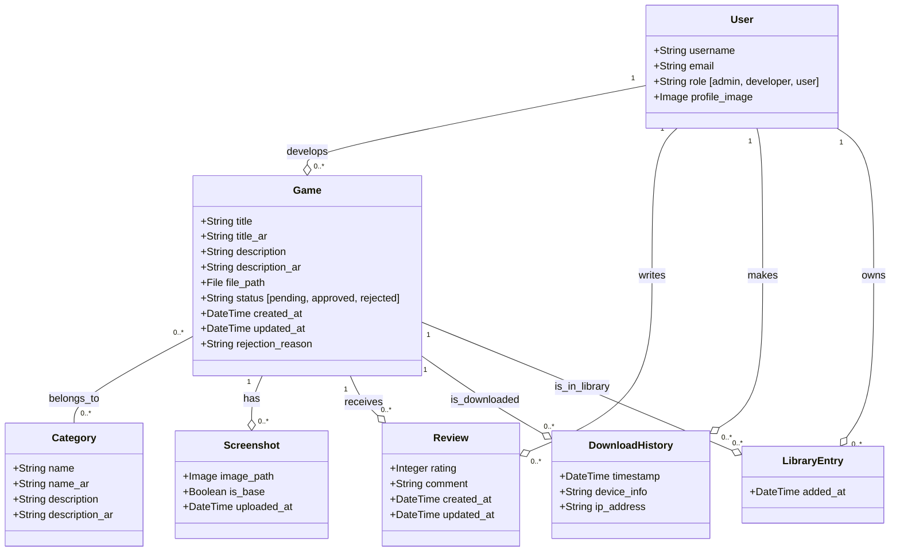

# Class Diagram

This diagram represents the data models and their relationships within the IndieHub backend.

## Description

- **User**: The central entity, with roles distinguishing between administrators, developers, and regular users.
- **Game**: The core content, submitted by developers and approved by admins. It has support for bilingual fields (English/Arabic).
- **Category**: Classifies games. A game can belong to multiple categories.
- **Screenshot**: Visual assets for games. One screenshot per game is marked as `is_base` (primary).
- **Review**: User-generated feedback and ratings for games.
- **DownloadHistory**: Tracks file downloads for analytics, linked to users (if logged in) or anonymous (via IP/Device).
- **LibraryEntry**: Represents a user's collection of games (e.g., purchased or saved games).
