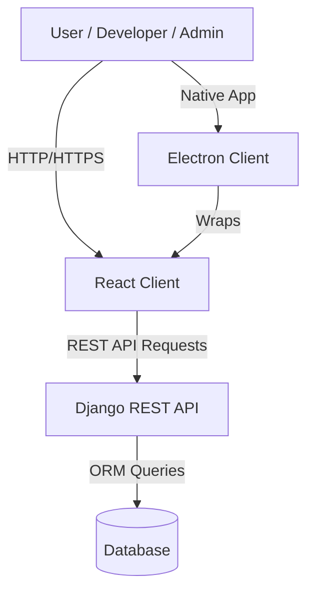

# Conception & Design Decisions

This document outlines the architectural decisions and design patterns chosen for **IndieHub**.

## 1. Global Architecture

IndieHub follows a **Decoupled Architecture** (Headless Backend), separating the business logic and data management from the user interface.

- **Backend**: Django (Python) serving a REST API.
- **Frontend**: React (TypeScript) consuming the API.
- **Desktop**: Electron wrapping the React application for desktop integration.
- **Database**: SQLite (Development) / PostgreSQL (Production-ready).

**Rationale**:
- **Scalability**: Frontend and Backend can be scaled independently.
- **Flexibility**: The API can serve multiple clients (Web, Desktop, Mobile) without changing backend logic.
- **Developer Experience**: Frontend and Backend teams can work in parallel using their respective best-in-class tools (Vite for React, Django for Python).

## 2. Backend Design

### Modular Monolith (Django Apps)
The backend is structured as a **Modular Monolith**, where features are grouped into distinct Django Apps:

- **`users`**: Handles Authentication (JWT/Token), User Profiles, and Roles.
- **`games`**: Core domain logic. Manages Games, Categories, Screenshots, and Reviews.
- **`downloads`**: Analytics and tracking system for file downloads.
- **`library`**: Manages personal user collections.

**Rationale**:
- **Separation of Concerns**: Each app has a specific responsibility, making the codebase easier to navigate and maintain.
- **Reusability**: Apps can potentially be reused in other projects or extracted into microservices if the system grows significantly.

### REST API with Django REST Framework (DRF)
We utilize **ViewSets** and **Serializers** extensively.

- **Serializers**: Handle data validation and conversion between complex types (Model instances) and JSON.
- **ViewSets**: Provide standard Actions (list, create, retrieve, update, delete) automatically, ensuring consistent URL patterns and behavior.
- **Routers**: Automatically generate URL configurations from ViewSets.

## 3. Frontend Design

### Component-Based Architecture
The React frontend is built using small, reusable functional components (Functional Components with Hooks).

- **`components/`**: Reusable UI elements (Buttons, Cards, Inputs).
- **`pages/`**: Views that aggregate components to form full pages.
- **`contexts/`**: Global state management (e.g., `AuthContext`, `LanguageContext`) to avoid "prop drilling."

### Type Safety
**TypeScript** is used throughout the frontend to ensure type safety, reducing runtime errors and improving developer productivity through autocomplete and compile-time checks.

## 4. Key Design Patterns

- **Repository Pattern (via Django ORM)**: Django's Manager/QuerySet abstraction acts as a repository layer, decoupling business logic from raw SQL.
- **Observer Pattern (Context API)**: The frontend uses React Context to notify components of global state changes (like user login).
- **Strategy Pattern (Authentication)**: DRF supports multiple auth strategies (Token, Session), allowing flexibility.

## 5. Security & Validation

- **RBAC (Role-Based Access Control)**: Custom permissions (`IsDeveloper`, `IsAdmin`) ensure users can only perform actions appropriate to their role.
- **Input Validation**: Handled at multiple layers:
    - **Frontend**: Basic data format checks (e.g., required fields).
    - **Backend Serializers**: Detailed data integrity checks.
    - **Database**: Final constraint enforcement (Unique, Not Null).
