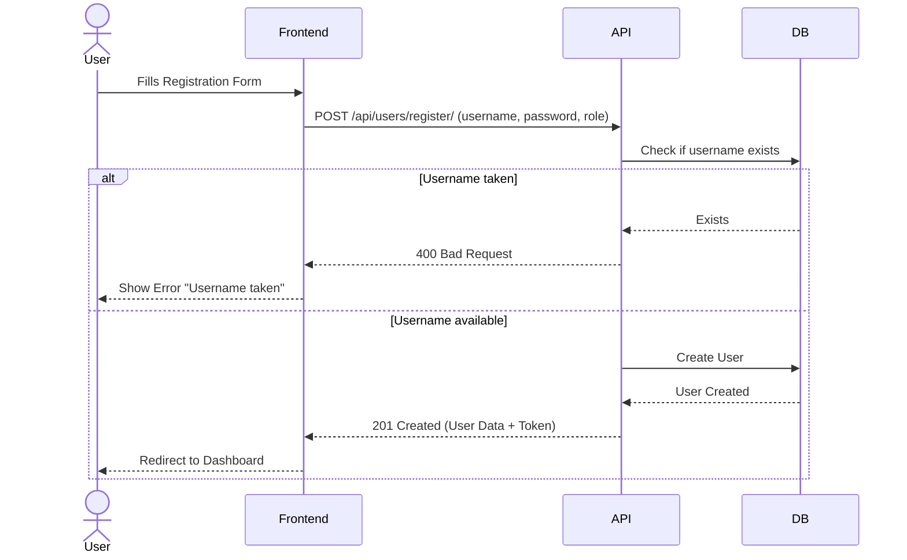
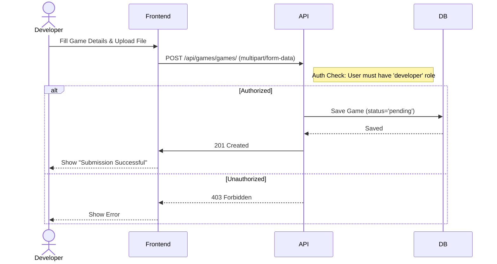
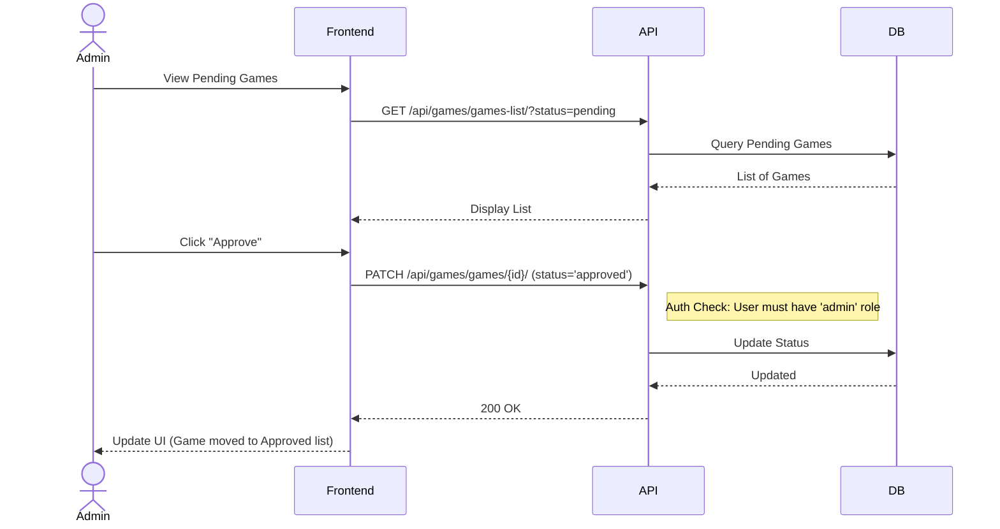
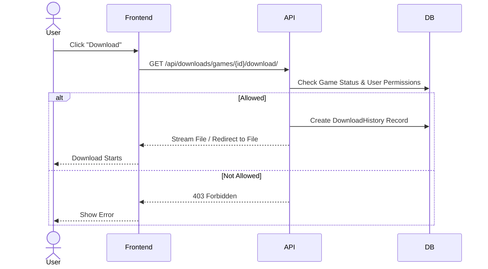

# Sequence Diagrams

These diagrams illustrate the main interaction flows within the IndieHub system.

## 1. User Registration

## 2. Game Submission (Developer)

## 3. Game Approval (Admin)

## 4. Game Download (User)

